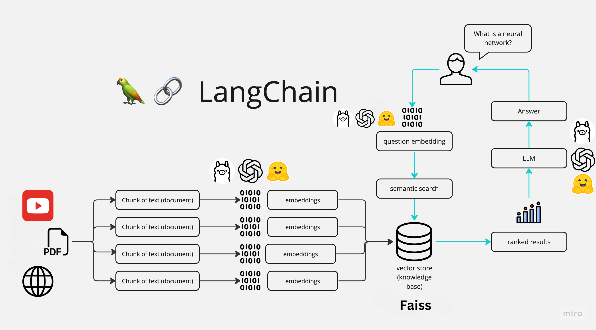
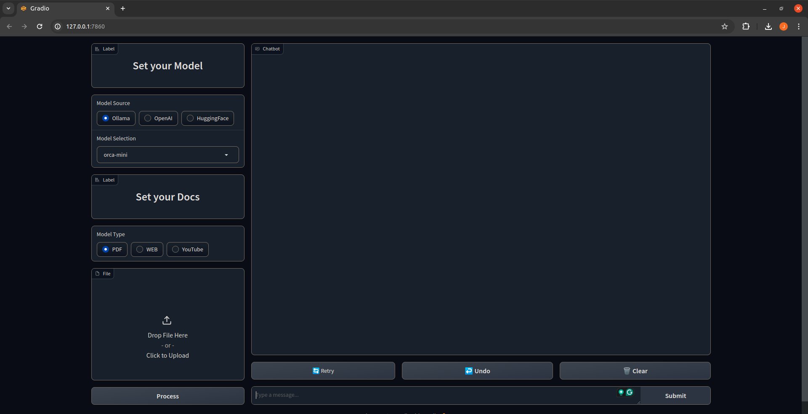
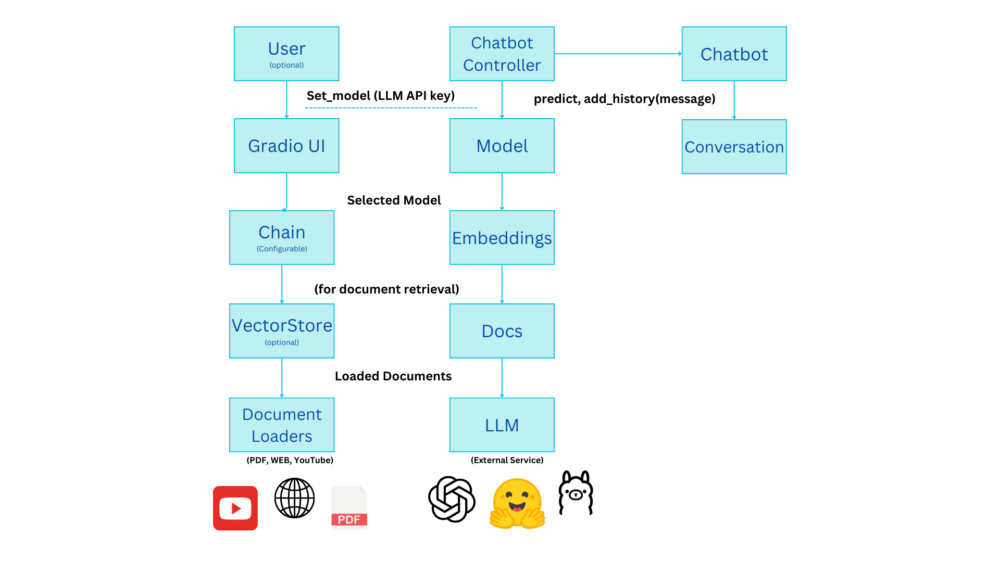

# Chat With Your Docs

## Introduction

---

The ChatWithYourDocs Chat App is a Python application that allows you to chat with multiple Docs formats like PDF, WEB pages and YouTube videos. You can ask questions about the PDFs using natural language, and the application will provide relevant responses based on the content of the documents. This app utilizes a language model to generate accurate answers to your queries. Please note that the app will only respond to questions related to the loaded Docs.

## How It Works

---



The application follows these steps to provide responses to your questions:

1. Doc Loading: The app reads multiple Docs types and extracts their text content.

2. Text Chunking: The extracted text is divided into smaller chunks that can be processed effectively.

3. Language Model: The application utilizes a language model to generate vector representations (embeddings) of the text chunks.

4. Similarity Matching: When you ask a question, the app compares it with the text chunks and identifies the most semantically similar ones.

5. Response Generation: The selected chunks are passed to the language model, which generates a response based on the relevant content of the Docs.

## Dependencies and Installation

---

To install the Chat With Your Docs App, please follow these steps:

1. Download [Ollama library](https://github.com/jmorganca/ollama)
   ```
   curl https://ollama.ai/install.sh | sh
   ```
2. pull the chat models we will use, in this case we will use [LLAMA2](https://ollama.ai/library/llama2), [MISTRAL](https://ollama.ai/library/mistral) and [GEMMA](https://ollama.ai/library/gemma)
   ```
   ollama pull llama2
   ```
   ```
   ollama pull mistral
   ```
   ```
   ollama pull gemma
   ```
3. Create new environment with python 3.9 and activate it, in this case we will use [conda](https://www.anaconda.com/download)

   ```
   conda create -n cwd python=3.9
   ```

   ```
   conda activate cwd
   ```

4. Clone the repository to your local machine.

   ```
   git clone https://github.com/jorge-armando-navarro-flores/chat_with_your_docs.git
   ```

   ```
   cd chat_with_your_docs
   ```

5. Install the required dependencies by running the following command:
   ```
   pip install -r requirements.txt
   ```

6. Install ffmpeg for YouTube videos:
   ```
   sudo apt-get install ffmpeg
   ```

## Usage

---

To use the Chat With Your Docs app, follow these steps:

1. Run the `main.py` file using the Streamlit CLI. Execute the following command:

   ```
   python3 main.py
   ```

2. The application will launch in your default web browser, displaying the user interface.
   

## Architecture



<div _ngcontent-ng-c1219956002="" class="markdown markdown-main-panel" dir="ltr" style="--animation-duration: 600ms; --fade-animation-function: linear;"><p data-sourcepos="1:1-1:212"></p><p data-sourcepos="3:1-3:12"><strong>Classes:</strong></p><ul data-sourcepos="5:1-11:0">
<li data-sourcepos="5:1-5:225"><strong>LLM:</strong> This abstract class serves as a blueprint for different LLM implementations. It has subclasses like <code>OllamaModel</code>, <code>OpenAIModel</code>, and <code>HFModel</code> that handle specific LLM providers (Ollama, OpenAI, and Hugging Face).</li>
<li data-sourcepos="6:1-6:110"><strong>Docs:</strong> This class manages document loading from various sources like PDFs, web pages, and YouTube videos.</li>
<li data-sourcepos="7:1-7:124"><strong>VectorStore:</strong> This class creates a vector representation of the documents using LLM embeddings for efficient retrieval.</li>
<li data-sourcepos="8:1-8:206"><strong>Chain:</strong> This class defines the processing pipeline for the chatbot. It can be a simple chain for basic question answering or a retrieval chain that searches documents based on the conversation history.</li>
<li data-sourcepos="9:1-9:145"><strong>ChatBot:</strong> This class handles user interaction, maintains conversation history, and calls the appropriate chain method to generate responses.</li>
<li data-sourcepos="10:1-11:0"><strong>ChatBotController:</strong> This class is the main interface for the user. It allows setting the LLM model, document source, and retrieval options. It also handles user queries and interacts with the ChatBot instance.</li>
</ul><p data-sourcepos="12:1-12:18"><strong>Functionality:</strong></p><ol data-sourcepos="14:1-31:0">
<li data-sourcepos="14:1-17:0">
<p data-sourcepos="14:4-14:18"><strong>Setting Up:</strong></p>
<ul data-sourcepos="15:5-17:0">
<li data-sourcepos="15:5-15:166">The user selects the LLM provider (Ollama, OpenAI, or HuggingFace) and model from a dropdown menu. Optionally, an API key might be needed for certain providers.</li>
<li data-sourcepos="16:5-17:0">The user can choose to add documents (PDF, web page URL, or YouTube video URL) for retrieval tasks.</li>
</ul>
</li>
<li data-sourcepos="18:1-26:0">
<p data-sourcepos="18:4-18:18"><strong>Processing:</strong></p>
<ul data-sourcepos="19:5-26:0">
<li data-sourcepos="19:5-19:101">Based on the chosen LLM and documents (if any), the controller configures the processing chain.</li>
<li data-sourcepos="20:5-20:85">A simple chain is used for basic question answering without document retrieval.</li>
<li data-sourcepos="21:5-26:0">A retrieval chain involves:
<ul data-sourcepos="22:9-26:0">
<li data-sourcepos="22:9-22:87">Creating a vector representation of the documents using the LLM's embeddings.</li>
<li data-sourcepos="23:9-23:88">Defining prompts to generate search queries based on the conversation history.</li>
<li data-sourcepos="24:9-24:71">Retrieving relevant documents based on the generated queries.</li>
<li data-sourcepos="25:9-26:0">Using the retrieved documents to answer the user's question.</li>
</ul>
</li>
</ul>
</li>
<li data-sourcepos="27:1-31:0">
<p data-sourcepos="27:4-27:19"><strong>Interaction:</strong></p>
<ul data-sourcepos="28:5-31:0">
<li data-sourcepos="28:5-28:59">The user types their questions in the chat interface.</li>
<li data-sourcepos="29:5-29:140">The controller calls the <code>predict</code> method of the ChatBot, passing the user's query and conversation history (if retrieval is enabled).</li>
<li data-sourcepos="30:5-31:0">The ChatBot retrieves the appropriate response based on the chosen chain configuration.</li>
</ul>
</li>
</ol><p data-sourcepos="32:1-32:24"><strong>Additional Features:</strong></p><ul data-sourcepos="34:1-35:0">
<li data-sourcepos="34:1-35:0">The interface includes buttons for "Undo" and "Clear" conversation history.</li>
</ul><p data-sourcepos="36:1-36:171">Overall, this code demonstrates a well-structured architecture for a chatbot that can leverage different LLMs and incorporate document retrieval for enhanced capabilities.</p></div>
